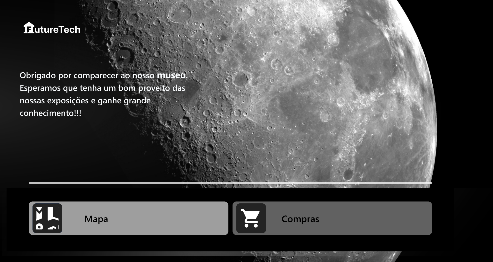

# Programa de Vendas do Museu da Primeira Viagem à Lua 🛒

Este programa é responsável por gerenciar as vendas de ingressos e produtos relacionados ao Museu da Primeira Viagem à Lua. Através deste programa, os funcionários do museu podem registrar vendas, controlar o estoque de produtos e gerar relatórios de vendas.

Para realizar esse projeto, foi necessário a criação de 4 programas que iriam fazer a interação da experiência com o usuário com o museu. Segue abaixo o repositório dos outros 3 programas:

-[Programa Principal 🏛️](https://github.com/Paulopaiv/PIM-III-QUESTIONARIO)

-[Programa de Avaliação 📊 ](https://github.com/Paulopaiv/PIM-III-ADS-VISITANTE) 

-[Programa de Administração 📋 ](https://github.com/Paulopaiv/PIM-III-ADS-ADM) 

## Funcionalidades Principais ⚙️

- Registro de vendas de ingressos.
- Geração de relatórios de vendas.
- Integração com sistema de pagamento.

## Tecnologias Utilizadas 🛠

- Plataforma: .NET
- Linguagem: C#
- Framework: Windows Forms

## Menu Principal 📋

O programa de vendas do Museu conta com um menu principal com as seguintes opções:

1. **Compras:** Esta opção permite aos visitantes comprar ingressos para o museu. Ao selecionar essa opção, o usuário será guiado pelo processo de compra de ingressos, podendo escolher o tipo de ingresso desejado e concluir a compra de forma segura e eficiente.

  

2. **Mapa do Museu:** Aqui, os visitantes podem visualizar o mapa do museu, facilitando a localização de exposições, áreas de interesse e serviços disponíveis no local. O mapa oferece uma visão geral do museu, auxiliando os visitantes a explorarem o espaço de forma mais organizada e proveitosa.

## ✒️ *Autores*

- [Ayumi Muraki](https://github.com/AyuMuraki)
- [Lucas](https://github.com/LucasCerione)
- [Nicolas Onishi](https://github.com/NicolasKonishi)
- [Paulo Paiva](https://github.com/Paulopaiv)

## Como contribuir 💪

Se você deseja contribuir para este projeto, siga as etapas abaixo:

1. Faça um fork deste repositório.
2. Crie um branch: `git checkout -b <nome_branch>`.
3. Faça suas alterações e confirme-as: `git commit -m '<mensagem_commit>'`
4. Envie para o branch original: `git push origin <nome_do_projeto> / <local>`
5. Criar a solicitação de pull.

Caso tenha alguma dúvida, consulte a documentação do GitHub sobre [como criar uma solicitação de pull](https://help.github.com/en/github/collaborating-with-issues-and-pull-requests/creating-a-pull-request).

## ⏭️ Próximos passos

- Agendamento de visitas: Integrar um sistema de agendamento de visitas ao museu;
- Gamificação: Criar um sistema de gamificação para incentivar a participação dos visitantes na pesquisa;
- Notificações: Implementar um sistema de notificações para eventos e atualizações do museu.

